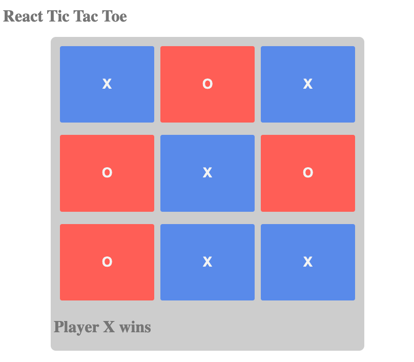

# Tic Tac Toe Exercise

### Description

This program is the game of tic tac toe, built in React for two players: Player X and Player O. The players take turns filling in squares in a 3x3 grid with their respective symbols: X and O, until one player has three in a row horizantally, vertically, or diagonally, signifying that player has won. The text at the bottom of the game keeps track of whose turn it is as well as displays which player wins if they get three in a row. 

### How to Run

1. Download the zip file in github and navigate to the **Tic-Tac-Toe-Exercise-main** directory in the terminal.
2. Run `http-server -c-1`.
3. When that is complete, load **localhost:8080** in the browser and click on the link for **index.html**. This will load the project in the browser.
4. click on the boxes to begin playing the game.

### Roadmap of Future Improvements

- **New Game** - I plan to add a button at the bottom of the page to start a new game. This would reset the board and the state of all the components. 
- **Prevent Overwriting** - Currently, clicking on a previously-clicked box will overwrite what was on the box before with the current player's symbol. I plan to prevent this by locking in player decisions once they have been made. I also plan to lock all the boxes from being clicked once the game is over.
- **Cat's Game** - I plan to introduce the end game contition of a "Cat's Game" to the program. Currently, if no player wins by the time all the boxes are clicked, nothing happens. This improvement would mean that, in this case, text would appear to say that there was no winner, and it was in fact a "Cat's Game".

### License Information
Completed as an assignment for the [MIT Professional Certificate in Coding: Full Stack Development with MERN](https://executive-ed.xpro.mit.edu/professional-certificate-coding?utm_source=Google&utm_medium=c&utm_term=mit%20coding&utm_location=1027726&utm_campaign=B-365D_US_GG_SE_PCC_Brand&utm_content=MIT-Coding___School_Duration&gclid=Cj0KCQiAweaNBhDEARIsAJ5hwbe5iGViYiDsRYlBGKAHHLbH-GiiJ16dKOBbV7tvosiu9UTfbS7tAygaAkW1EALw_wcB).

See [MIT license](https://github.com/brandontanner/Tic-Tac-Toe-Exercise/blob/main/LICENSE).
